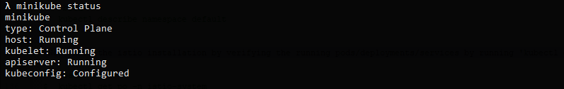
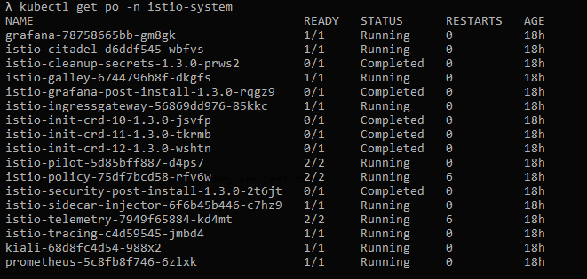
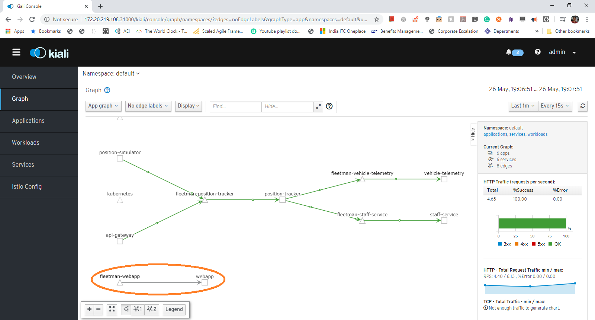
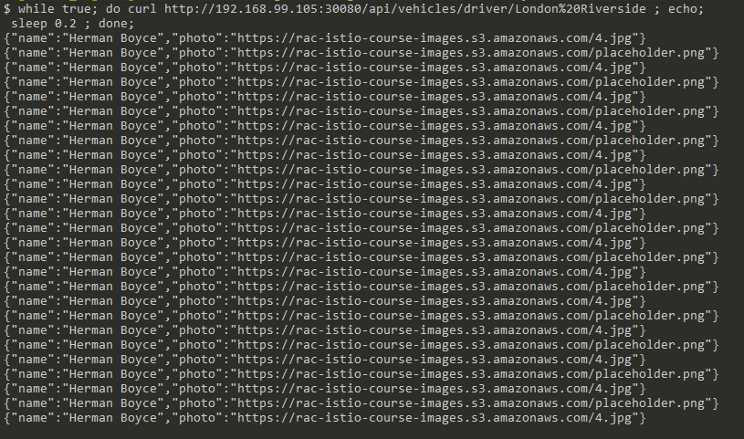

summary: Istio hands-on codelab
id: istio-workshop
categories: Istio
tags: medium
status: Draft 
authors: Nagamohan Koganti

# Istio hands-on codelab
<!-- ------------------------ -->
## Overview 
Duration: 2

### What You’ll Learn 

In this codelab we are going to demonstrate some of the Istio features like 
- **Observability** through ***Telemetry*** 
- **Trafic management** 
	

> For demonstarting istio features we are going to use one sample application called Fleetman service consists of various micro services deployed using k8s.

- **Setting up the env, Installing Minikube** 
- **Installing Istio using kubectl** 
- **Observability demo using**
	* Kiali
	* Jaeger
	* Grafana
 
- **Traffic routing**
	- ***Basic Canary demo using k8s***
	- ***Istio Canary demo of weighted traffic routing***  (33%-66% and 95%-5% wighted percentage routing)
	
- **Gateway**
   	- ***Istio Gateway (Egress)***
	- ***Prfix based uri routing***
	- ***Header based routing***
	- ***Dark Releases***

<!-- ------------------------ -->
## Environment Setup 
Duration: 15


### Kubectl Installation
- Follow K8S kubectl installation instructions according to your OS given at [__kubectl installation__](https://kubernetes.io/docs/tasks/tools/install-kubectl).

on MacOS run '__brew install kubectl__'
On Windows using [chocolatey](https://chocolatey.org/install) package manager using '__choco install kubectl__'

- Check kubectl installation by running '__kubectl version__'

``` bash
 $ kubectl version --client
```

### Minikube Installation
- Follow minikube installation instructions according to your OS given at [__K8S Minikube__](https://kubernetes.io/docs/tasks/tools/install-kubectl).

on MacOS run '__brew install minikube__'
On Windows using [chocolatey](https://chocolatey.org/install) package manager using '__choco install minikube__'

- Check minikube installation by running '__minkube version__'
``` bash
 $ minikube version
```

### Start Minikube
``` bash
 $ minikube start --memory 4096 
```
check minikube status by running '__minikube status__'
``` bash
 $ minikube status
```
>The minikube status should shown the following status as shown in below figure.



>Check kubectl installation by running '__kubectl version__' whcih should give both client and server details.

``` bash
 $ kubectl version 
```

### Clone the demo Repo
> Clone the folowing [demo repo](https://github.com/naganinja/istio-udemy.git) to exercise the istio features

``` bash
 $ git clone https://github.com/naganinja/istio-udemy.git
``` 

### Install Istio
> Change the directory to the clone repo/_course_files

 ``` bash
 $ cd path-to-cloned-repo/_course_files/1 Telemetry
``` 

> Now run the following commands one after the other

'kubectl apply -f 1-istio-init.yaml' will initialize the istio

``` bash
$  kubectl apply -f 1-istio-init.yaml
```

'kubectl apply -f 2-istio-minikube-reduced.yaml' will install the istio

``` bash
$  kubectl apply -f 2-istio-minikube-reduced.yaml
```

'kubectl apply -f 3-kiali-secret.yaml' will setup the user secret credential for Kiali login user admin/admin
``` bash
$  kubectl apply -f 3-kiali-secret.yaml
```

'kubectl describe namespace default' will describe the default namespace of minikube k8s
``` bash
$  kubectl describe namespace default
```

Now let's add a label 'istio-injection=enabled' to inject a envoy proxy along side of an each and every application getting deployed on pods.

``` bash
$  kubectl apply -f 4-label-default-namespace.yaml
```

'Now check whether the label 'istio-injection=enabled' is added to default namespace or not' by running 

``` bash
$  kubectl describe namespace default
```

'Now check the istio installation by verifying the running pods by running 'kubectl get po -n istio-system'

``` bash
$  kubectl get po -n istio-system
```

make sure all the pods are running/completed as shown in below figure.




### Install sample fleetman micro service application

Now let's install sample Fleetman microservice application by running 'kubectl apply -f 5-application-no-istio.yaml'

``` bash
$  kubectl apply -f 5-application-no-istio.yaml
```


### Get Minikube IP

``` bash
$  minikube ip
```

### Access Istio UI's 

- Kiali webapp --> http://minikubeip:31000
- Jaegar webapp --> http://minikubeip:31001
- Grafana webapp --> http://minikubeip:31002

### Install sample fleetman micro service application

### Open Fleetman web application

Now let's open the Fleetman web application in browser using minikube ip

- Fleetman webapp --> http://minikubeip:30080

//TODO - add the architecture digram of fleetman microservice application

## Istio Observability Demo

Kiali - Kiali provides information on what microservices are part of my Istio service mesh and how they are connected to each other and how they are performing.

Let's visualize the service mesh topolgy of sample fleetman micro service application using Kiali web application UI http://minikubeip:31000

>Login to Kiali UI using crdentials admin/admin

 

> Kiali Services tab shows what are the different services that are deployed in servicemesh

 

> Kiali Workloads tab shows what are the different workloads that are part of servicemesh

 

> Kiali Applications tab shows what are the different applications that are part of servicemesh

 

> Kiali ServiceGraph tab shows what are the different services that are part of servicemesh, and how they are connected to each other.

 

> Initially the service graph show the traffic connection grayed out between fleetman-webapp service to webapp application as shown in below figure.

 

> Now let's access the fleetman web app continously through curl, which will update the Kiali service graph dynamically by depicting the traffic connectivity in green from fleetman-webapp service to web application as shown in below figure.

 
 
## Istio Traffic management Demo
 Duration: 5
 
### Canary Deployment

> In this code excercise we are going to see how canary deployment can be done using K8S vs Istio.
First lets see the 50-50 deployment of k8s with safe version and risky version of Staff service deployed to serve 50% requests with safe the other with risky.
Here the safe version will show a placeholder image , the risky version will show the actual photograph of driver which is developed newly and getting tested with k8s canary.

+ Lets cd into "2 Traffic" and deploy the *'5-application-no-istio.yaml'* which deploys placeholder and actual photgraph version staff service. 
``` bash
$  cd 'clone-repo/_course_files/2 Traffic'  
$  kubectl apply -f 5-application-no-istio.yaml
```
+ Lets open Fleetman web app frontend UI http://minikubeip:30080 and verify the 50-50 traffic of staff service being served by k8s or not by clicking Trucks in the left hand panel of UI one after the other. Try to observe the behavior of placeholder/actual photograph being served in right hand bottom part.
  
+ Lets run some curl command which continously try to acces the staff service responsible for serving the driver photograph of a truck.
> If you are on windows try to download [__curl__](https://curl.haxx.se/windows) and use it or else download [__cygwin__](https://www.cygwin.com/setup-x86_64.exe) and try to run the following commmand.

``` bash
while true; do curl http://192.168.99.105:30080/api/vehicles/driver/London%20Riverside ; echo; sleep 0.2 ; done;
```
+ You should be observing the response from staff service in a 50-50 manner as shown in below figure
. 

> So far we have just seen 50-50 percentage k8s canary deployment, what if we want canary to be deployed in 90-10 % way? Can this be achived by k8s. Yes we can, but with the cost of 9 replicas of safe service version and 1 replica of risky staff version resources. Which is not desirable as it is resource intensive.

> Lets see how Istio is going to solve with less pods like 1 pod for safe and 1 pod for risky version using two important custom resource definitions introduced by istio called __'VirtualService'__ and __'DestinationRule'__. You can get more info on these at istio-docs [VirtualService](https://istio.io/docs/concepts/traffic-management/#virtual-services) & [DestinationRule](https://istio.io/docs/concepts/traffic-management/#destination-rules).

> Lets move ahead with our demo of 90-10 weighted percentage traffic split canary deployment using Istio. Before applying istio's virtual services and destination rules lets run the above continuous curl command and then run the following command.   

``` bash
$  kubectl apply -f 6-istio-rules.yaml
```

>Observe how dynamically the behaviour is getting changed from k8s 50-50 to the serving of 90-10 weighted percentage traffic split, It's happening with out changing any application service code or any down time through istio's configuration file '6-istio-rules.yaml' application as shown in below figure.

 


## Istio Gateway Demo
 Duration: 10

> Let's see how Istio Gateway being used for managing inbound and outbound traffic of your mesh. The use cases we are going to demo here are
+ URI prefix based routing 
+ Dark releases with header based routing

demonstarted through __/canary__ , __/experimental__ URI paths & with headers serving different versions of front end fleetman web UI.

### URI paths based routing 

The scenario we are going to demo here is that the fleetman front-end angular UI microservice have two versions of UI, the canary or experimental ones show the Red ribbon titlte as 'Fleet Management Istio Premium Enterprise Edition' if the UI being accessed with /canary or /experimental in URI or else normal Gray color ribboned title ''.

Lets run the following command to apply the URI prefix gateway rules.

``` bash
$  cd 'clone-repo/_course_files/3 Gateways Solution - Prefix Routing'  
$  kubectl apply -f 6-istio-rules.yaml
```

To verify the above istio rules lets run the following commands 
``` bash
curl -s http://192.168.99.106:31380/experimental | grep title
```

``` bash
curl -s http://192.168.99.106:31380/canary | grep title
```

The above commands will output the content as shown in below figure, where both __/experimental__ and __/canary__ will return title as __'Fleet Management Istio Premium Enterprise Edition'__ ,where as plain root url will return title as __'Fleet Management'__

 


## Istio Dark releases demo 
Duration: 5
> So far we have just witnessed how gateway can be used to route the traffic using __'Virtual Services'__ & __'Destination Rules'__, now lets see how Dark Releases can be done using Istio in production clusters with out impacting the exisitng application using header based routing.

> Dark releases are the ones where newly developed featured can be pushed to production clusters and get tested with out impacting any existing application features. This gives a great advantage of reducing operation costs of application in terms of not provisioning a dev/staging cluster equalent to production to test how the newly developed features are getting behaving.

Lets clean the minikube cluster by running 

``` bash
$  minikube delete
```

and then apply all the yaml files of __'4 Dark Releases'__ folder one after the other in numeric order, while applying these make sure you give some gap after running __'kubectl apply -f 2-istio-minikube-reduced.yaml'__ and wait for all the pods of __istio-system__ namespace are up and running using command __'kubectl get po -n istio-system'__. 

Then apply remaining yaml one by one.

Lets run the following command to apply the dark release rules, where users can access the newly developed features in production by passing some header and there by validate them.

``` bash
$  cd 'clone-repo/_course_files/4 Dark Releases'  
$  kubectl apply -f  6-istio-rules.yaml
$  kubectl apply -f  7-dark-release-rules.yaml
```

> Now let's verify the above applied istio rules installing browser extensions like [__'Modheader'__](https://chrome.google.com/webstore/detail/modheader/idgpnmonknjnojddfkpgkljpfnnfcklj?hl=en) by passing some custom headers as configured in 6-istio-rules.yaml.

The extension we are using here is for chrome called as __'Modheader'__

> Lets access the url from bowser with following headers added in Modheader as shown in the figures below.

+ First access the fleetman web app __without__ passing header __x-my-header__ and observe how the Title being rendered, you should observe the UI like the one given below.

> 

+ Now access the fleetman web app by passing header __x-my-header__ with value __canary__ and UI title should be rendered in __red banner__ like the one given below.

> 


## Istio Fault Injection Demo
 Duration: 5
 
 TODO
 
## Istio mTLS Demo
 Duration: 2
 
 TODO
 
 


	


