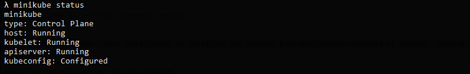
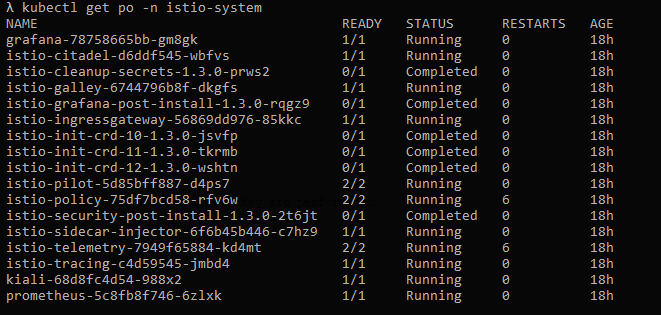
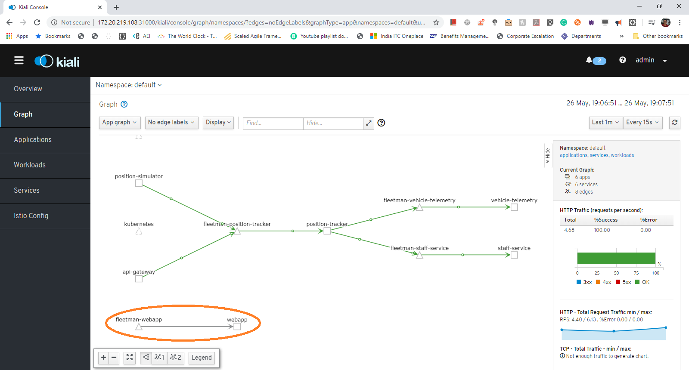
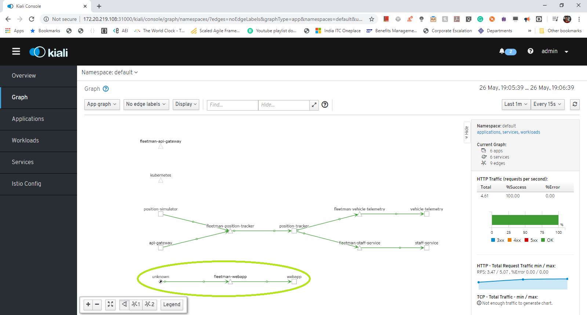

summary: Istio hands-on codelab
id: istio-workshop
categories: Istio
tags: medium
status: Draft 
authors: Nagamohan Koganti

# Istio hands-on codelab
<!-- ------------------------ -->
## Overview 
Duration: 2

### What You’ll Learn 

In this codelab we are going to demonstrate some of the Istio features like 
- **Observability** through ***Telemetry*** 
- **Trafic management** 
	

> For demonstarting istio features we are going to use one sample application called Fleetman service consists of various micro services deployed using k8s.

- **Setting up the env, Installing Minikube** 
- **Installing Istio using kubectl** 
- **Observability demo using**
	* Kiali
	* Jaeger
	* Grafana
 
- **Traffic routing**
	- ***Basic Canary demo using k8s***
	- ***Istio Canary demo of weighted traffic routing***  (33%-66% and 95%-5% wighted percentage routing)
	
- **Gateway**
   	- ***Istio Gateway (Egress)***
	- ***Prfix based uri routing***
	- ***Header based routing***
	- ***Dark Releases***

<!-- ------------------------ -->
## Environment Setup 
Duration: 15

### Docker desktop installation
- Follow Docker desktop installation instructions according to your OS given at [__kubectl installation__](https://docs.docker.com/desktop)

- Check Docker desktop installation by running '__docker version__'
``` bash
 $ docker version
```

### Kubectl Installation
- Follow K8S kubectl installation instructions according to your OS given at [__kubectl installation__](https://kubernetes.io/docs/tasks/tools/install-kubectl).

on MacOS run '__brew install kubectl__'
On Windows using [chocolatey](https://chocolatey.org/install) package manager using '__choco install kubectl__'

- Check kubectl installation by running '__kubectl version__'

``` bash
 $ kubectl version --client
```

### Minikube Installation
- Follow minikube installation instructions according to your OS given at [__K8S Minikube__](https://kubernetes.io/docs/tasks/tools/install-kubectl).

on MacOS run '__brew install minikube__'
On Windows using [chocolatey](https://chocolatey.org/install) package manager using '__choco install minikube__'

- Check minikube installation by running '__minkube version__'
``` bash
 $ minikube version
```

### Start Minikube
``` bash
 $ minikube start --memory 4096 
```
check minikube status by running '__minikube status__'
``` bash
 $ minikube status
```
>The minikube status should shown the following status as shown in below figure.



>Check kubectl installation by running '__kubectl version__' whcih should give both client and server details.

``` bash
 $ kubectl version 
```

### Clone the demo Repo
> Clone the folowing [demo repo](https://github.com/naganinja/istio-udemy.git) to exercise the istio features

``` bash
 $ git clone https://github.com/naganinja/istio-udemy.git
``` 

### Install Istio
> Change the directory to the clone repo/_course_files

 ``` bash
 $ cd path-to-cloned-repo/_course_files/1 Telemetry
``` 

> Now run the following commands one after the other

'kubectl apply -f 1-istio-init.yaml' will initialize the istio

``` bash
$  kubectl apply -f 1-istio-init.yaml
```

'kubectl apply -f 2-istio-minikube-reduced.yaml' will install the istio

``` bash
$  kubectl apply -f 2-istio-minikube-reduced.yaml
```

'kubectl apply -f 3-kiali-secret.yaml' will setup the user secret credential for Kiali login user admin/admin
``` bash
$  kubectl apply -f 3-kiali-secret.yaml
```

'kubectl describe namespace default' will describe the default namespace of minikube k8s
``` bash
$  kubectl describe namespace default
```

Now let's add a label 'istio-injection=enabled' to inject a envoy proxy along side of an each and every application getting deployed on pods.

``` bash
$  kubectl apply -f 4-label-default-namespace.yaml
```

'Now check whether the label 'istio-injection=enabled' is added to default namespace or not' by running 

``` bash
$  kubectl describe namespace default
```

'Now check the istio installation by verifying the running pods by running 'kubectl get po -n istio-system'

``` bash
$  kubectl get po -n istio-system
```

make sure all the pods are running/completed as shown in below figure.




### Install sample fleetman micro service application

Now let's install sample Fleetman microservice application by running 'kubectl apply -f 5-application-no-istio.yaml'

``` bash
$  kubectl apply -f 5-application-no-istio.yaml
```


### Get Minikube IP

``` bash
$  minikube ip
```

### Access Istio UI's 

- Kiali webapp --> http://minikubeip:31000
- Jaegar webapp --> http://minikubeip:31001
- Grafana webapp --> http://minikubeip:31002

### Install sample fleetman micro service application

### Open Fleetman web application

Now let's open the Fleetman web application in browser using minikube ip

- Fleetman webapp --> http://minikubeip:30080

//TODO - add the architecture digram of fleetman microservice application

## Istio Observability Demo

Kiali - Kiali provides information on what microservices are part of my Istio service mesh and how they are connected to each other and how they are performing.

Let's visualize the service mesh topolgy of sample fleetman micro service application using Kiali web application UI http://minikubeip:31000

>Login to Kiali UI using crdentials admin/admin

 

> Kiali Services tab shows what are the different services that are deployed in servicemesh

 

> Kiali Workloads tab shows what are the different workloads that are part of servicemesh

 

> Kiali Applications tab shows what are the different applications that are part of servicemesh

 

> Kiali ServiceGraph tab shows what are the different services that are part of servicemesh, and how they are connected to each other.

 

> Initially the service graph show the traffic connection grayed out between fleetman-webapp service to webapp application as shown in below figure.

 

> Now let's access the fleetman web app continously through curl, which will update the Kiali service graph dynamically by depicting the traffic connectivity in green from fleetman-webapp service to web application as shown in below figure.

 
 
 ## Istio Traffic management Demo


	


